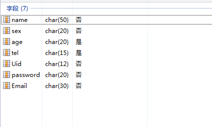

#先说明一下,使用之前的一些工作吧0.0

#首先是 数据库建表

#数据库使用的是mysql

建好的表示这样子的(只有一个表) 大概

然后使用命令  python ./manage.Py runserver 8000
就可以在 127.0.0.1:8000 里访问网站DEMO

主页直接进入127.0.0.1:8000即可  注册页面在 /sign-up/

-------------------------------------
-------------------------------------
---------------------------------------
可以一起学习 我也是新手 刚刚学习Django不久 希望共同进步
